# 🛡️ ShieldNet — Production-Grade ML Website Threat Detection System

An enterprise-level malicious website detection and blocking system powered by TensorFlow deep learning, FastAPI async backend, and React Native mobile app.

## Architecture Overview

```mermaid
graph TB
    subgraph "Mobile App — React Native"
        A[Dashboard + Live Stats] --> B[Real-Time URL Scanner]
        A --> C[Blocked Sites Manager]
        A --> D[Threat Analytics]
        A --> E[Settings & ML Control]
    end

    subgraph "FastAPI Backend — Async Production Server"
        F["/api/v1/scan — URL Analysis"]
        G["/api/v1/sites — Block/Unblock CRUD"]
        H["/api/v1/ws — WebSocket Live Feed"]
        I["/api/v1/analytics — Threat Stats"]
        J["Middleware: Rate Limiter + Auth + CORS"]
    end

    subgraph "ML Engine — TensorFlow"
        K["Branch 1: URL Char-Level CNN"]
        L["Branch 2: Engineered Feature DNN"]
        M["Ensemble Fusion Layer"]
        N["Threat Classifier — 5 Classes"]
        O["Explainability Module — SHAP + Feature Attribution"]
    end

    subgraph "Data Layer"
        P[(SQLite DB — Sites + History)]
        Q[("Redis Cache — Scan Results")]
        R["Threat Intel Feeds — PhishTank/URLhaus"]
    end

    B --> F
    C --> G
    A --> H
    D --> I
    F --> K & L
    K & L --> M --> N --> O
    F --> P & Q
    G --> P
    R --> L
```



## User Review Required

> [!IMPORTANT]
> **Deep Learning Architecture**: We use a **dual-branch TensorFlow neural network** — one branch processes raw URL characters (CNN) for pattern detection, the other processes 40+ engineered features (DNN). Both branches fuse into an ensemble for maximum accuracy. This is research-grade architecture used by Google Safe Browsing and Microsoft SmartScreen.

> [!WARNING]
> **Training**: The model trains on synthetic data (~50,000 samples) for the prototype. For true production deployment, you'd integrate live feeds from PhishTank, URLhaus, and VirusTotal APIs.

---

## Proposed Changes

### Component 1: Project Foundation

#### [NEW] [requirements.txt](file:///c:/Users/prate/OneDrive/Desktop/legit0/requirements.txt)

```
# Core ML
tensorflow>=2.15.0
scikit-learn>=1.4.0
numpy>=1.26.0
pandas>=2.2.0
shap>=0.45.0

# API Server
fastapi>=0.110.0
uvicorn[standard]>=0.27.0
pydantic>=2.6.0
python-multipart>=0.0.9
websockets>=12.0

# Data & Storage
aiosqlite>=0.20.0
aiohttp>=3.9.0
redis>=5.0.0
databases>=0.9.0

# URL Analysis
tldextract>=5.1.0
python-whois>=0.9.0
beautifulsoup4>=4.12.0
requests>=2.31.0
validators>=0.22.0

# Security & Utils
python-jose[cryptography]>=3.3.0
passlib[bcrypt]>=1.7.4
joblib>=1.3.0
colorama>=0.4.6
rich>=13.7.0
```

#### [NEW] [config.py](file:///c:/Users/prate/OneDrive/Desktop/legit0/config.py)

Central configuration: model paths, API settings, threat thresholds, feature toggles, database URI, Redis URI.

---

### Component 2: TensorFlow Deep Learning Model

#### [NEW] [ml_engine/\_\_init\_\_.py](file:///c:/Users/prate/OneDrive/Desktop/legit0/ml_engine/__init__.py)

#### [NEW] [ml_engine/feature_extractor.py](file:///c:/Users/prate/OneDrive/Desktop/legit0/ml_engine/feature_extractor.py)

**40+ engineered features** across 6 categories:

| Category | Features | Count |
|----------|----------|-------|
| **URL Lexical** | Length, dots, hyphens, digits, special chars, @ symbol, path depth, query params count, fragment, entropy, consecutive consonants | 12 |
| **Domain Intel** | Domain age, registrar reputation, subdomain depth, uses URL shortener, suspicious TLD (.xyz, .top, .buzz), punycode/IDN | 8 |
| **Security** | HTTPS, SSL validity days, cert issuer trust, HSTS header, CSP header, X-Frame-Options | 6 |
| **Content** | Password fields, credit card inputs, iframes, hidden elements, external links ratio, form-action mismatch, JS obfuscation score | 7 |
| **Behavioral** | Redirect count, final URL divergence, page load time, response code, robots.txt blocked | 5 |
| **Reputation** | In known blacklist, WHOIS privacy enabled, domain in alexa/tranco top 1M | 3 |

#### [NEW] [ml_engine/url_tokenizer.py](file:///c:/Users/prate/OneDrive/Desktop/legit0/ml_engine/url_tokenizer.py)

Character-level URL tokenizer:
- Maps each character to an integer ID (alphabet, digits, special chars → 0-73)
- Pads/truncates URLs to 200 characters
- Used by the CNN branch to learn character-level patterns (e.g., "paypa1" vs "paypal")

#### [NEW] [ml_engine/model.py](file:///c:/Users/prate/OneDrive/Desktop/legit0/ml_engine/model.py)

**Dual-Branch TensorFlow Neural Network:**

```
Branch 1 — URL Character CNN:
  Input(200 chars) → Embedding(74, 32) → Conv1D(128, k=3) → Conv1D(128, k=5) →
  GlobalMaxPool → Dense(128) → Dropout(0.4) → Dense(64)

Branch 2 — Engineered Feature DNN:
  Input(41 features) → BatchNorm → Dense(256, ReLU) → Dropout(0.3) →
  Dense(128, ReLU) → Dropout(0.3) → Dense(64, ReLU)

Fusion:
  Concatenate(Branch1, Branch2) → Dense(128, ReLU) → Dropout(0.4) →
  Dense(64, ReLU) → Dense(5, Softmax)

Output Classes: [safe, phishing, malware, data_leak, scam]
```

- Custom `ThreatDetectionModel` class with `train()`, `predict()`, `predict_with_confidence()`
- Learning rate scheduling with cosine decay
- Early stopping + model checkpointing
- Class weight balancing for imbalanced threats

#### [NEW] [ml_engine/explainer.py](file:///c:/Users/prate/OneDrive/Desktop/legit0/ml_engine/explainer.py)

**Production-grade explanation engine:**

1. **Feature Attribution** — Per-feature contribution scores from the DNN branch
2. **Risk Factor Mapping** — Maps each risky feature to a template:
   - `"The domain was registered {age} days ago"` → NEW_DOMAIN risk
   - `"The login form sends data to {external_domain}"` → FORM_MISMATCH risk
   - `"SSL certificate expired {days} ago"` → SSL_EXPIRED risk
3. **Confidence Calibration** — Temperature scaling for reliable probability scores
4. **Threat Summary** — Structured JSON with severity, category, confidence, top reasons, and recommended action

Example output:
```json
{
  "threat_level": "CRITICAL",
  "category": "phishing",
  "confidence": 0.94,
  "risk_score": 92,
  "reasons": [
    {"factor": "Domain registered 2 days ago", "severity": "high", "icon": "🔴"},
    {"factor": "URL mimics 'paypal.com' using character substitution", "severity": "high", "icon": "🔴"},
    {"factor": "Login form submits to external domain", "severity": "high", "icon": "🔴"},
    {"factor": "No valid SSL certificate", "severity": "medium", "icon": "🟡"},
    {"factor": "4 hidden form fields collecting data", "severity": "medium", "icon": "🟡"}
  ],
  "recommendation": "DO NOT enter any personal information. This site is designed to steal your credentials.",
  "blocked": true
}
```

#### [NEW] [ml_engine/dataset_generator.py](file:///c:/Users/prate/OneDrive/Desktop/legit0/ml_engine/dataset_generator.py)

Generates 50,000 labeled samples with realistic feature correlations:
- **Safe (40%)** — Short URLs, old domains, valid SSL, no suspicious patterns
- **Phishing (25%)** — Brand impersonation, new domains, form mismatches, keyword stuffing
- **Malware (15%)** — Obfuscated JS, excessive redirects, hidden iframes, suspicious downloads
- **Data Leak (12%)** — No HTTPS, excessive form fields, no privacy policy, third-party trackers
- **Scam (8%)** — Too-good-to-be-true offers, no contact info, fake urgency keywords

#### [NEW] [ml_engine/train_model.py](file:///c:/Users/prate/OneDrive/Desktop/legit0/ml_engine/train_model.py)

Training pipeline:
1. Generate/load dataset → stratified 80/10/10 train/val/test split
2. Train dual-branch model for up to 50 epochs (early stopping patience=5)
3. Evaluate on test set → classification report, confusion matrix, ROC-AUC per class
4. Save to `ml_engine/saved_model/`

---

### Component 3: FastAPI Production Backend

#### [NEW] [api/\_\_init\_\_.py](file:///c:/Users/prate/OneDrive/Desktop/legit0/api/__init__.py)

#### [NEW] [api/server.py](file:///c:/Users/prate/OneDrive/Desktop/legit0/api/server.py)

**Production FastAPI application:**
- CORS middleware, request logging, error handlers
- Lifespan handler to load ML model on startup
- Structured JSON responses with Pydantic models
- Background task processing for heavy scans

#### [NEW] [api/routes/scan.py](file:///c:/Users/prate/OneDrive/Desktop/legit0/api/routes/scan.py)

| Method | Endpoint | Description |
|--------|----------|-------------|
| POST | `/api/v1/scan` | Analyze URL → threat classification + explanation |
| POST | `/api/v1/scan/batch` | Analyze multiple URLs concurrently |
| GET | `/api/v1/scan/history` | Paginated scan history with filters |

#### [NEW] [api/routes/sites.py](file:///c:/Users/prate/OneDrive/Desktop/legit0/api/routes/sites.py)

| Method | Endpoint | Description |
|--------|----------|-------------|
| GET | `/api/v1/sites/blocked` | List all blocked sites (paginated, filterable) |
| POST | `/api/v1/sites/block` | Manually block a site |
| POST | `/api/v1/sites/unblock` | Unblock a site (user override) |
| DELETE | `/api/v1/sites/{id}` | Remove from blocked list entirely |

#### [NEW] [api/routes/settings.py](file:///c:/Users/prate/OneDrive/Desktop/legit0/api/routes/settings.py)

| Method | Endpoint | Description |
|--------|----------|-------------|
| GET | `/api/v1/settings` | Get current protection settings |
| PUT | `/api/v1/settings` | Update settings (toggle ML, sensitivity level) |
| GET | `/api/v1/analytics` | Threat stats: blocked count by category, timeline |

#### [NEW] [api/routes/websocket.py](file:///c:/Users/prate/OneDrive/Desktop/legit0/api/routes/websocket.py)

WebSocket endpoint for real-time scan results push to mobile app.

#### [NEW] [api/models/schemas.py](file:///c:/Users/prate/OneDrive/Desktop/legit0/api/models/schemas.py)

Pydantic v2 request/response schemas for all endpoints with validation.

#### [NEW] [api/database.py](file:///c:/Users/prate/OneDrive/Desktop/legit0/api/database.py)

Async SQLite database with tables: `blocked_sites`, `scan_history`, `settings`.

---

### Component 4: React Native Mobile App

#### [NEW] [mobile_app/](file:///c:/Users/prate/OneDrive/Desktop/legit0/mobile_app/)

Expo-managed React Native app with these screens:

| Screen | Features |
|--------|----------|
| **Dashboard** | Animated shield (ON/OFF), real-time threat counter, protection stats cards, recent scans feed |
| **URL Scanner** | URL input with paste detection, animated scanning progress, threat result card with color-coded severity |
| **Blocked Sites** | Filterable list by threat category, swipe-to-unblock, search, bulk actions |
| **Threat Detail** | Full threat explanation, risk factor cards, "Unblock Anyway" with confirmation modal, share report |
| **Analytics** | Threat distribution pie chart, timeline graph, category breakdown |
| **Settings** | ML protection toggle, sensitivity slider (low/medium/high), notification preferences, clear data, about |

---

## Verification Plan

### Automated Tests

```bash
# 1. Train the model
python ml_engine/train_model.py

# 2. Run API tests
python -m pytest tests/ -v

# 3. Start the server
uvicorn api.server:app --host 0.0.0.0 --port 8000

# 4. Test scan endpoint
curl -X POST http://localhost:8000/api/v1/scan \
  -H "Content-Type: application/json" \
  -d "{\"url\": \"http://paypa1-secure-verify.xyz/login\"}"
```

### Manual Verification
1. Train model → verify >90% accuracy on test set
2. Start FastAPI → verify `/docs` Swagger UI loads
3. Scan known-malicious URL → verify explanation JSON
4. Block/unblock flow → verify state persistence
5. Start mobile app → verify all screens render and connect to API
